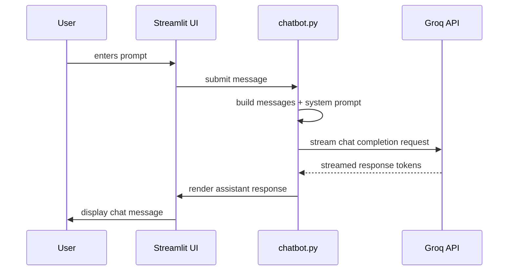

# Groq AI Assistant

A lightweight Streamlit chatbot interface that connects to the Groq API for multi-turn AI conversations.

The app supports:
- Groq API key authentication via `.env` or manual sidebar entry
- Model selection across Groq-supported LLMs
- Temperature control for creativity vs. focus
- Streaming assistant responses in a modern, light-themed UI
- Saving and loading chat history to/from JSON

## Project overview

This repository contains a single Streamlit app, `chatbot.py`, which provides an interactive AI assistant powered by Groq.
The UI is styled for a clean white/light appearance and includes a sidebar for authentication, settings, and history controls.

## Features

- **Groq API authentication**: Uses `GROQ_API_KEY` from `.env` if present, or accepts a key in the sidebar.
- **Model selector**: Choose between available Groq models.
- **Temperature slider**: Adjust response creativity.
- **Custom system persona**: Enter a system prompt to tune the assistant's behavior.
- **Chat history**: Save conversation history to `chat_history.json` and restore from JSON files.
- **Streaming output**: Displays assistant replies token-by-token for a smooth chat experience.

## Setup

1. Install Python dependencies:

```powershell
python -m pip install -r requirements.txt
```

2. Create a `.env` file from the example:

```powershell
copy .env.example .env
```

3. Add your Groq API key to `.env`:

```text
GROQ_API_KEY=gsk_your_key_here
```

4. Run the app:

```powershell
python -m streamlit run chatbot.py
```

## Usage

1. Open the app in your browser.
2. Enter or confirm your Groq API key in the sidebar.
3. Select a model and adjust the temperature.
4. Optionally update the system persona and press `Apply Persona`.
5. Type a message in the chat input to start the conversation.
6. Save or restore chat history using the sidebar controls.

## Environment configuration

The app loads `GROQ_API_KEY` from a local `.env` file using `python-dotenv`.
If the key is present, the sidebar input is prefilled and the app connects automatically.
If no key is found, enter one manually in the sidebar.

## Mermaid diagrams

### Architecture

```mermaid
flowchart LR
  Browser[Browser / Streamlit UI] -->|user actions| StreamlitApp[Streamlit app (chatbot.py)]
  StreamlitApp -->|auth & chat requests| GroqAPI[Groq API]
  StreamlitApp -->|save/load| LocalFile[chat_history.json / .env]
  LocalFile -->|load env key| StreamlitApp
  GroqAPI -->|streamed responses| StreamlitApp
  StreamlitApp -->|render chat| Browser
```

### Chat flow



## Notes

- Keep `.env` secret and do not commit it to version control.
- Use the sidebar to clear conversations, save history, or restore previous sessions.

## Repository

This repository is intended for local experimentation with the Groq API and a Streamlit chat interface.
